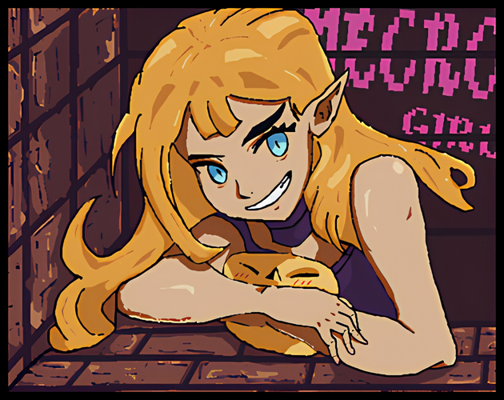
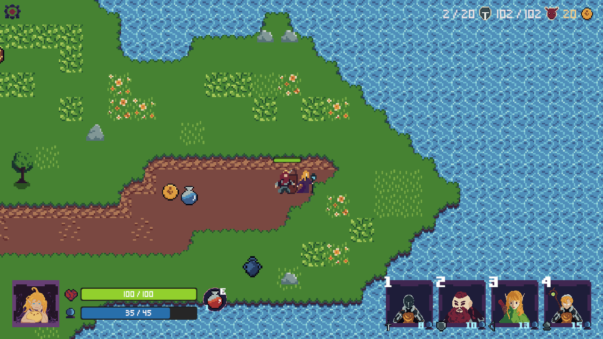
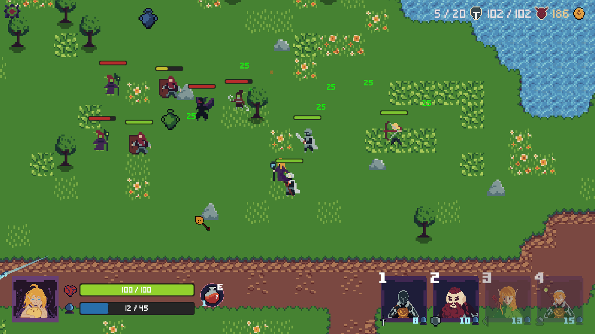
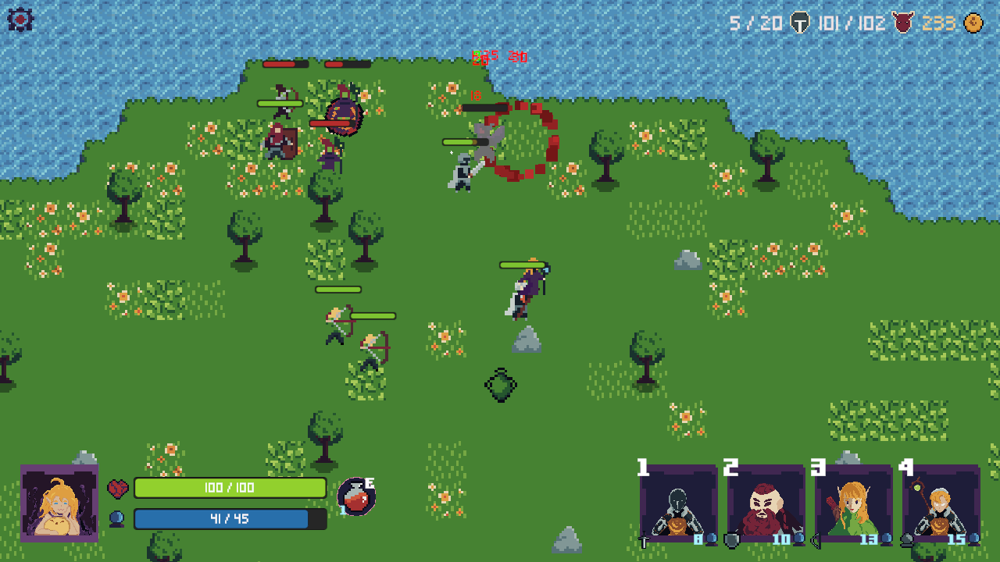
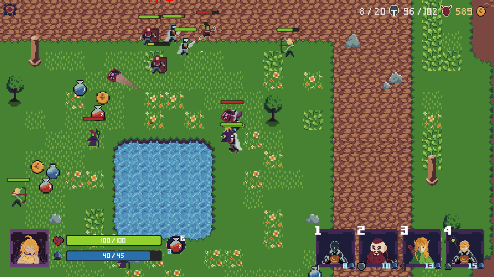
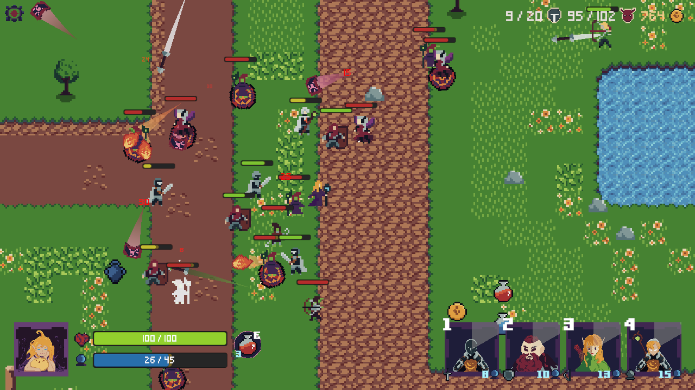

# NECROGIRL

  

## OVERVIEW

This was originally an entry for [__Ludum Dare 55__](https://ldjam.com/events/ludum-dare/55), which started on _April 13, 2024_. It was made within 72 hours of the jam.

__THEME: SUMMONING__

This `develop` branch is __PROTECTED__, it reflects the currently stable state of the game.

__Post-jam__ version is now available on [__itch.io__](https://constance012.itch.io/necrogirl).

## DESCRIPTION

A magical elf named __Asari__ who has the power to summon other units to fight along side her using her will power. Accompany her and her loyal friends to __strike__ through the __ferocious foes_ and achieve victory.

## TOOLS

- Unity
- Visual Studio Code
- Aseprite
- Photoshop
- LabChirp

## LINKS

Check out the _jam submission_ page [__HERE__](https://ldjam.com/events/ludum-dare/55/necrogirl).

Play it _directly_ or download for your _current platform_ [__HERE__](https://constance012.itch.io/necrogirl).

## INGAME CAPTURES

© 2024-2025 Hiyuka Studios.